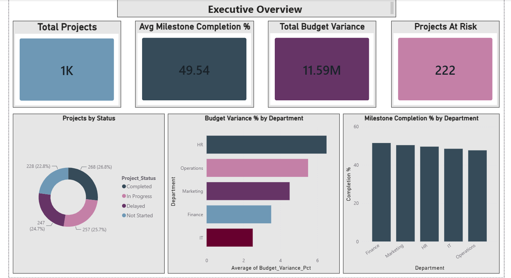
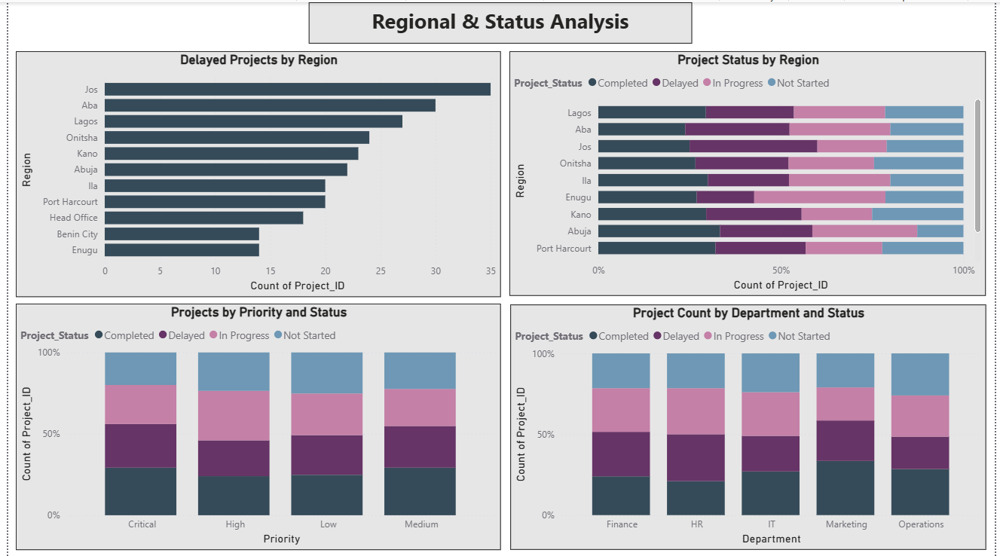

# Project Portfolio Performance Dashboard

> *Turning scattered project trackers into one clear view of what's on time, on budget, and at risk.*

> 🎓 **Portfolio Project** — This is an independent analytical project
> built to demonstrate Business Intelligence and PMO analysis skills.
> It uses a public Kaggle dataset and does not represent work
> performed for any employer.

---

## The Problem

Organizations running large project portfolios rarely struggle with a lack of data — they struggle with a lack of *visibility*. Budget overruns go unnoticed until quarter-end, milestone slippage is buried across dozens of trackers, and no one can say with confidence which department, manager, or region needs intervention right now.

This project builds an end-to-end PMO analytics solution that turns a raw 1,000-project dataset into a 4-page Power BI dashboard, giving managers a single place to spot risk, control cost, and act on resourcing gaps.

---

## Business Objective

This dashboard answers six questions that PMO and operations leaders actually ask:

| # | Business Question |
|---|---|
| 1 | Are projects on time and on budget? |
| 2 | Which departments are over budget — and by how much? |
| 3 | Which regions have the most delivery delays? |
| 4 | How many projects are at risk of failing? |
| 5 | Which project managers are delivering best — and who needs support? |
| 6 | Where are the highest-impact opportunities to improve delivery? |

---

## Dataset

| Attribute | Detail |
|---|---|
| **Source** | [Kaggle — Project Management Dataset](https://www.kaggle.com/datasets/derrickkuria/project-management) |
| **Size** | 1,000 project records |
| **Format** | CSV |

**Original Columns (from Kaggle):**

| Column | Description |
|---|---|
| `id` | Unique project identifier |
| `Company` | Project/company name |
| `Site Name` | Delivery region |
| `EntryDate` | Project start date |
| `WorkStatus` | Project status (In Progress, Completed, Not Started, Stopped) |
| `CompleteDate` | Actual completion date |
| `ReccuringRevenue` | Recurring revenue figure |
| `NRR` | Net revenue retention figure |
| `Task Owner` | Assigned project manager |
| `Currency` | Project currency |

**Data Enrichment & Methodology**

The source dataset provided project identity, dates, and status — but no budget, milestone, or department-level detail, which a PMO dashboard requires. The following fields were **synthetically generated** using Power Query, derived from existing fields to keep results internally consistent:

| Field | How it was generated |
|---|---|
| `Department` | Assigned via formula across 5 departments |
| `Priority` | Assigned via formula across 4 priority levels |
| `Planned_End_Date` | Calculated from Start_Date + randomized duration |
| `Actual_Spend` | Derived from Planned_Budget ± randomized variance |
| `Budget_Variance` / `Budget_Variance_Pct` | Calculated from Planned_Budget vs Actual_Spend |
| `Milestone_Total` / `Milestone_Completed` | Assigned via formula to simulate milestone tracking |
| `Milestone_Completion_Pct` | Calculated from milestone fields above |

All department names, priorities, and performance figures are synthetic and used for demonstration purposes only — they do not reflect real companies or individuals.

**Note:** `Delay_Days` was excluded from final analysis due to inconsistent date formats in the source data. Timeline risk is assessed via `Project_Status` instead.

---

## Tools & Technologies

| Tool | Purpose |
|---|---|
| **Microsoft Excel + Power Query** | Data cleaning, enrichment, mixed-date-format resolution |
| **SQL (SQLite / DB Browser)** | Business-question validation, exploratory analysis |
| **Power BI Desktop** | Interactive 4-page dashboard |
| **GitHub** | Version control and portfolio hosting |

---

## Project Structure

```
project-portfolio-performance-dashboard/
├── data/
│   └── project_portfolio_clean.csv
├── sql/
│   └── sql_queries.sql
├── dashboard/
│   └── project_portfolio_dashboard.pbix
├── screenshots/
│   ├── executive_overview.png
│   ├── budget_analysis.png
│   ├── regional_status_analysis.png
│   └── milestone_manager_performance.png
└── README.md
```

---

## Dashboard Overview

The dashboard is structured across four analytical pages:

**Page 1 — Executive Overview**
High-level KPIs for senior management: total projects, average milestone completion, total budget variance, and projects at risk. Includes a status breakdown and budget/milestone comparison by department.

**Page 2 — Budget Analysis**
Drill-down into where money is being lost. Planned vs. actual spend by department, budget variance by priority level, and variance by project manager.

**Page 3 — Regional & Status Analysis**
Where delivery is breaking down geographically. Delayed projects by region, status distribution across regions, and status breakdown by priority and department.

**Page 4 — Milestone & Manager Performance**
Who is delivering, and who needs support. Milestone completion by department, completed vs. total milestones, and a full project manager performance summary table.

---

## Screenshots

### Executive Overview


### Budget Analysis


### Regional & Status Analysis


### Milestone & Manager Performance


---

## Key Findings

- The portfolio is running **4.75% over budget overall** — €11.59M over a planned €244M, across 1,000 projects.
- **22% of the portfolio (222 projects)** are at risk — delayed or in progress with under 50% of milestones completed.
- **HR has the worst budget control** at 8.1% variance, while **IT is most efficient** at 2.83%.
- Budget overruns are **not isolated to low-priority work** — Critical-priority projects show overrun rates just as high as Low-priority ones, pointing to a systemic issue rather than poor prioritization.
- **Jos and Aba** have the highest concentration of delayed projects, while **Enugu and Benin City** are the most reliable delivery regions.
- **Operations is a double risk area** — it has both the highest budget variance and the lowest milestone completion rate (46.54%) of any department.
- **203 projects (just over 20% of the portfolio) have no assigned project manager** — a clear resourcing gap.
- Among assigned managers, completion rates range from **45.3% to 54.0%**, with a roughly 1.5-point spread in average budget variance — performance is uneven but not extreme.

---

## Recommendations

1. **Audit HR's budget process first.** At 8.1% variance — nearly 3x IT's rate — HR is the single biggest lever for closing the portfolio's €11.59M gap. Start with a cost-control review of HR's largest active projects.

2. **Treat "Critical" priority as a budget risk flag, not a delivery guarantee.** Since overrun rates don't improve with priority level, raising a project's priority alone won't protect its budget — pair priority escalation with a dedicated budget checkpoint.

3. **Investigate regional bottlenecks in Jos and Aba.** With the highest delay counts in the portfolio, these regions likely share a common root cause (resourcing, local approvals, supply chain) worth a focused review before scaling further work there.

4. **Close the manager assignment gap.** With 203 projects unmanaged, assigning ownership is a low-cost, high-impact fix — unmanaged projects are a likely contributor to the 22% at-risk figure.

5. **Use Operations as a pilot for combined budget-and-milestone tracking.** Since it scores worst on both dimensions simultaneously, a single intervention there — rather than two separate budget and milestone initiatives — would have the most concentrated impact.

---

## SQL Analysis

Business questions validated using SQL in DB Browser for SQLite.
Full queries available in [`sql/sql_queries.sql`](sql/sql_queries.sql)

Key analyses:
- Portfolio budget variance by department
- Projects at risk identification
- Regional delay analysis
- Project manager performance comparison
- Milestone completion rates

---

## Author

**Vigneshwari Nalla**
Aspiring Operations Analyst | Business Analyst | Project Coordinator

📍 Based in France | Open to internships and junior analyst roles

🔗 [LinkedIn](https://www.linkedin.com/in/vigna24/) · [GitHub](https://github.com/vigneshwari2408) · 📧 vigna2408@gmail.com

---

*Built to demonstrate end-to-end analytics thinking: from data cleaning through SQL validation to dashboard delivery and business recommendations.*
