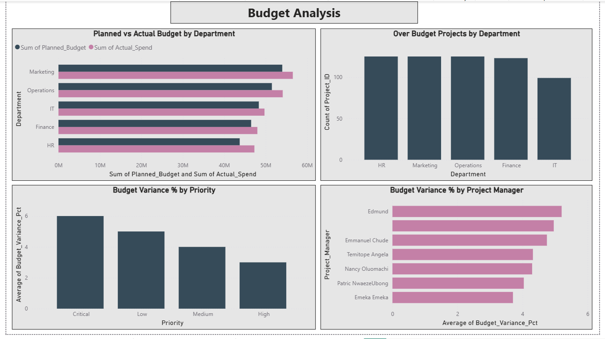
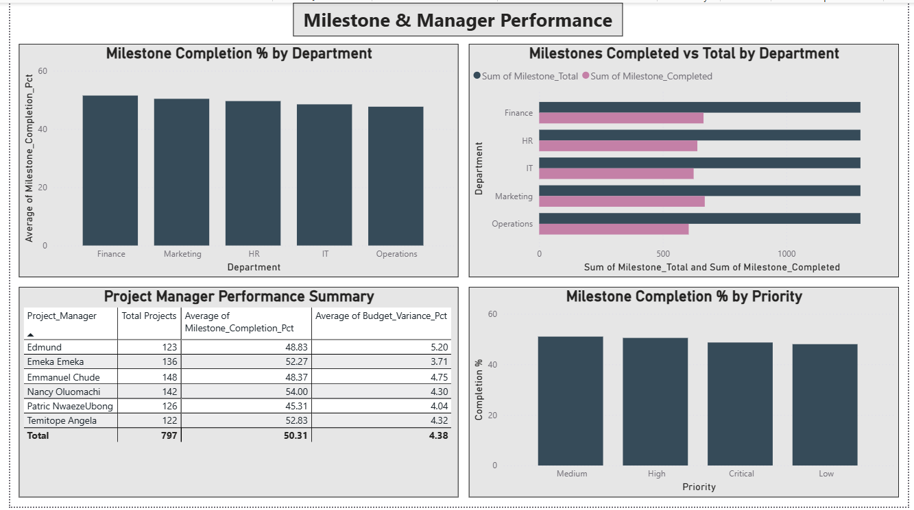

# Project Portfolio Performance Dashboard

## Overview
This project simulates a real-world PMO (Project Management Office) dashboard built to help management monitor project performance across budget, milestones, and regional delivery. It demonstrates skills in data preparation, SQL analysis, and Power BI visualization.

---

## Business Problem
Organizations managing large project portfolios struggle to answer critical questions:
- Are projects on time and on budget?
- Which departments are underperforming?
- Where are resources being inefficiently allocated?
- Which project managers need support?

This dashboard answers all of these questions in one place.

---

## Tools Used
| Tool | Purpose |
|---|---|
| Microsoft Excel + Power Query | Data cleaning and enrichment |
| DB Browser for SQLite | SQL analysis and query validation |
| Power BI Desktop | Dashboard development |
| GitHub | Version control and portfolio hosting |

---

## Dataset
- **Source:** Kaggle — Project Management Dataset
- **Base rows:** 1,000 projects
- **Columns:** 19
- **Enrichment:** Original dataset enriched with budget variance, milestone tracking, and planned timeline columns using Power Query
- **Note:** Delay_Days calculation was impacted by inconsistent date formats in source data. Timeline analysis is based on Project_Status instead.

---

## Dashboard Pages

### Page 1 — Executive Overview
High-level portfolio summary for senior management.
- Total Projects: 1,000
- Average Milestone Completion: 49.54%
- Total Budget Variance: 11.59M over budget
- Projects At Risk: 222 (22% of portfolio)

### Page 2 — Budget Analysis
Deep dive into budget performance by department, priority, and project manager.
- HR department most over budget at 8.1% variance
- IT department most efficient at 2.83% variance
- Critical priority projects have highest budget overruns
- Edmund has highest average budget variance among managers

### Page 3 — Regional & Status Analysis
Project status distribution across regions and departments.
- Jos region has most delayed projects (35)
- Enugu and Benin City performing best
- Budget overruns are systemic across all departments

### Page 4 — Milestone & Manager Performance
Milestone delivery tracking and project manager comparison.
- Nancy Oluomachi is top performer (54% completion, 4.3% variance)
- Patric NwaezeUbong needs support (45.31% completion)
- 203 projects have no assigned manager — resource gap identified

---

## Key Business Insights
1. **Portfolio is 4.75% over budget overall** — immediate cost control needed
2. **22% of projects are at risk** — delayed or in progress with under 50% milestones done
3. **HR department needs intervention** — highest budget variance at 8.1%
4. **Operations is double risk** — over budget AND lowest milestone completion
5. **203 projects unassigned** — critical resource management gap

---

## SQL Analysis
Business questions answered using SQL in DB Browser for SQLite.
Full queries available in `sql_queries.sql`

Key analyses:
- Portfolio budget variance by department
- Projects at risk identification
- Regional delay analysis
- Project manager performance comparison
- Milestone completion rates

---

## Project Structure

| File | Description |
|---|---|
| `project_portfolio_clean.csv` | Cleaned dataset (1000 rows, 19 columns) |
| `sql_queries.sql` | SQL business analysis queries |
| `project_portfolio_dashboard.pbix` | Power BI dashboard file |
| `executive_overview.png` | Page 1 screenshot |
| `budget_analysis.png` | Page 2 screenshot |
| `regional_status_analysis.png` | Page 3 screenshot |
| `milestone_manager_performance.png` | Page 4 screenshot |
| `README.md` | Project documentation |
---

## 👤 Author

**Vigneshwari Nalla**

📍 Based in France | Open to internships and junior analyst roles

🔗 [LinkedIn](https://www.linkedin.com/in/vigna24/) | 📧 vigna2408@gmail.com | [GitHub Profile](https://github.com/vigneshwari2408)

Aspiring Operations Analyst | Business Analyst | Project Coordinator
